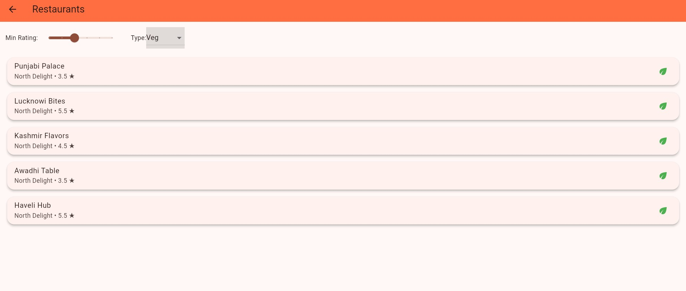

# MasalaSwada

MasalaSwada is a cross-platform food ordering app built with Flutter. It allows users to browse restaurants, search for dishes, view details, place orders, check weather at their location, and view order history. The app features a modern UI, city selection, cuisine browsing, and more.

---


## Screenshots

Screenshots of the app are placed in the `assets/screenshots/` directory. Reference them in the README as shown below:




---

## Table of Contents

- [Project Overview](#project-overview)
- [Features](#features)
- [Architecture](#architecture)
- [Technologies Used](#technologies-used)
- [Project Structure](#project-structure)
- [Setup & Installation](#setup--installation)
- [Usage](#usage)
- [Customization](#customization)
- [Testing](#testing)
- [Contributing](#contributing)
- [License](#license)
- [Contact](#contact)

---

## Project Overview

FoodExpress is designed to provide a seamless food ordering experience. Users can:

- Select their city and location
- Browse restaurants by cuisine, rating, and veg/non-veg
- Search for restaurants or dishes
- View restaurant and dish details
- Place orders and view confirmation
- Track previous orders in order history
- Select location on map and view weather

---

## Features

- **Browse Restaurants:** Filter by cuisine, rating, and veg/non-veg
- **Search:** Find restaurants or dishes by name
- **Restaurant & Dish Details:** View menu, prices, and details
- **Order Placement:** Place orders and view confirmation
- **Order History:** Track previous orders
- **Map & Location:** Select location on map and view current weather
- **City Selection:** Choose from major Indian cities
- **Modern UI:** Custom themes and backgrounds

---

## Architecture

- **Flutter:** UI and cross-platform logic
- **BLoC Pattern:** State management using `flutter_bloc`
- **Repository Pattern:** Data fetching and dummy data
- **Models:** Restaurant, Dish, CartItem, Address, PaymentOption
- **Screens:** Modular UI screens for each feature
- **Utils:** Theme, dummy data, helpers

---

## Technologies Used

- [Flutter](https://flutter.dev/) (Dart)
- [flutter_bloc](https://pub.dev/packages/flutter_bloc)
- [google_maps_flutter](https://pub.dev/packages/google_maps_flutter)
- [flutter_map](https://pub.dev/packages/flutter_map)
- [latlong2](https://pub.dev/packages/latlong2)
- [http](https://pub.dev/packages/http)
- [cupertino_icons](https://pub.dev/packages/cupertino_icons)

---

## Project Structure

```
lib/
  main.dart                # App entry point
  bloc/                    # BLoC state management
  models/                  # Data models (Restaurant, Dish, etc.)
  repositories/            # Data fetching logic
  screens/                 # UI screens
  utils/                   # Theme, dummy data, helpers
  widgets/                 # Reusable widgets
assets/
  images/                  # App images
test/                      # Unit and widget tests
```

---

## Setup & Installation

### Prerequisites

- [Flutter SDK](https://flutter.dev/docs/get-started/install)
- Dart SDK (see `pubspec.yaml` for compatible version)
- Android Studio / VS Code / Xcode (for platform-specific builds)

### Installation & Running

1. **Clone the repository:**
	```sh
	git clone https://github.com/shreyabhatb/Order_Your_Food.git
	cd foodexpress
	```

2. **Install dependencies:**
	```sh
	flutter pub get
	```

3. **Run the app:**
	```sh
	flutter run
	```

---

## Usage

- **Home Screen:** Select city, search for restaurants/dishes, browse cuisines
- **Restaurant List:** Filter by rating and veg/non-veg
- **Restaurant Details:** View menu and place orders
- **Order Placed:** Confirmation and payment info
- **Order History:** View previous orders
- **Map & Weather:** Pick location and see weather info

---

## Customization

- **Add Restaurants/Dishes:** Edit `lib/utils/dummy_data.dart`
- **Change Theme:** Edit `lib/utils/app_theme.dart`
- **Add Assets:** Place images in `assets/images/` and update `pubspec.yaml`

---

## Testing

Unit and widget tests are located in the `test/` directory. To run tests:

```sh
flutter test
```

---

## Contributing

Pull requests are welcome! For major changes, please open an issue first to discuss what you would like to change.

---
## License

This project is for demo purposes and is not licensed for commercial use.

---

## Contact

For questions, reach out to [shreyabhatb](https://github.com/shreyabhatb).


